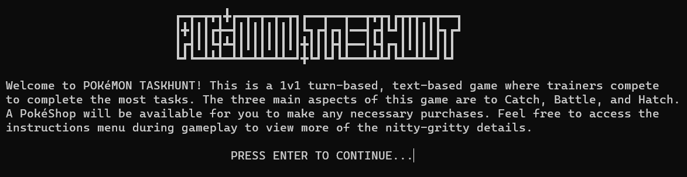
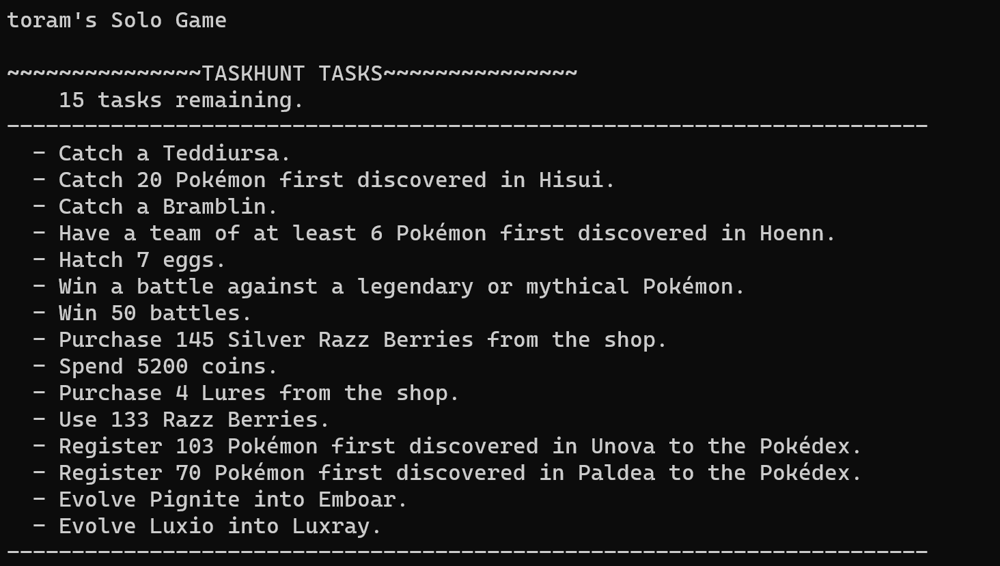
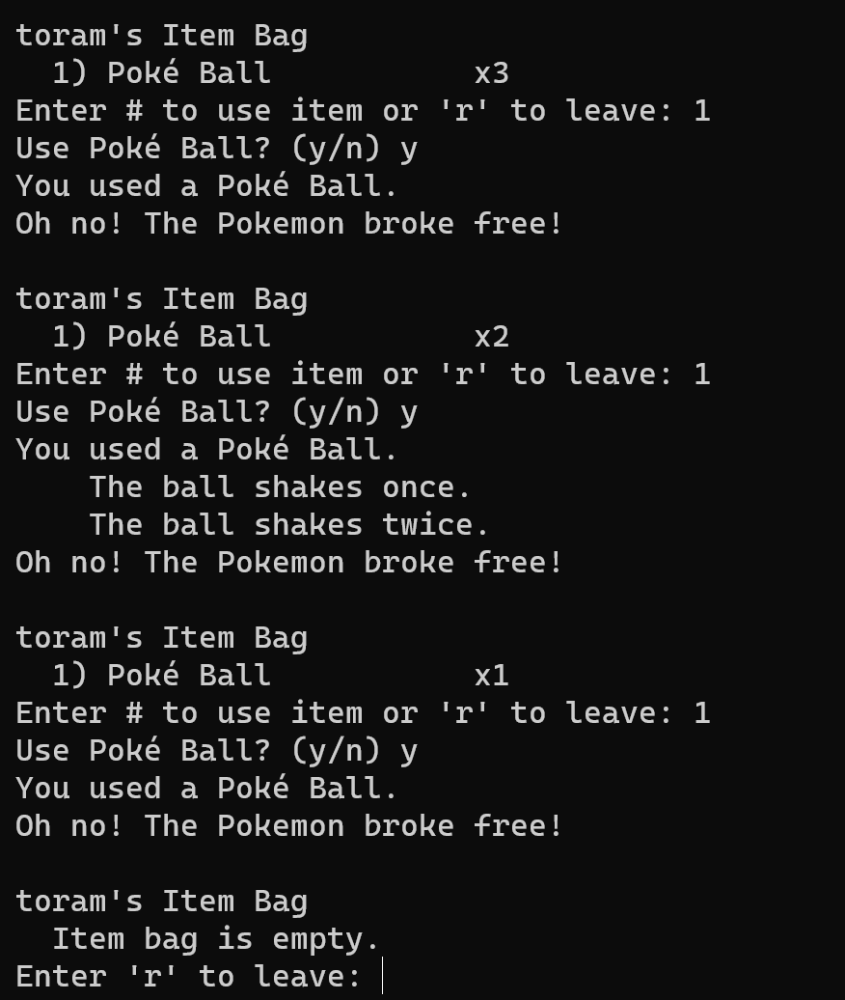

# Pokémon Taskhunt v.1.0.8

**Developed by Brian Yu, 2023**

Simple console text-based game inspired by the Pokémon franchise for up to two players. Players can either solo complete catching/battling tasks or compete to complete the most tasks (search Minecraft Lockout).

**This is my first project and likely contains lots of bugs and uncaught exceptions.

**Known issues:**
- Improper encoding may result in incorrectly displayed title; minimal impact on gameplay
- Improper encoding may result in exception thrown for pokemon names with special characters (i.e. Nidoran♂ and Nidoran♀); priority

### Setup
- Clone this repository.
- Open any terminal and run `java Client` (ensure you have a compatible java version installed).
